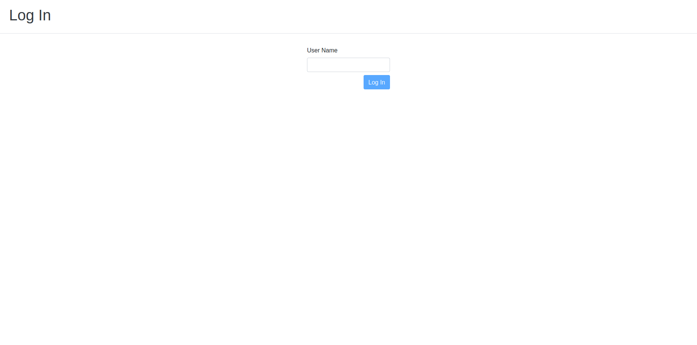

# MicroFocus

## Angular application which does the following:
1. Displays a list of message posts
2. Enables a user to log in and submit new posts or edit existing posts

## General Requirements
- Must be an Angular project generated with the Angular CLI
- Uses standard Bootstrap styles
- Conforms to the page layouts as shown in the attached wireframes
- Must not use 3rd party libraries, e.g. underscore
- Uses the following REST API to obtain user and post data:
  -  https://jsonplaceholder.typicode.com/posts
  -  https://jsonplaceholder.typicode.com/users
## Screenshots

## TODO
- [X] Store authorization
- [X] modal windows
- [X] Guards for unloginned users
- [X] Guards for unauthorized users
- [X] Refresh page after logout
- [ ] Spec reqs
- [ ] E2E coverage 

## Development server

Run `ng serve` for a dev server. Navigate to `http://localhost:4200/`. The app will automatically reload if you change any of the source files.

## Build

Run `ng build` to build the project. The build artifacts will be stored in the `dist/` directory. Use the `--prod` flag for a production build.

## Running unit tests

Run `ng test` to execute the unit tests via [Karma](https://karma-runner.github.io).

## Running end-to-end tests

Run `ng e2e` to execute the end-to-end tests via [Protractor](http://www.protractortest.org/).

This project was generated with [Angular CLI](https://github.com/angular/angular-cli) version 10.0.0.
